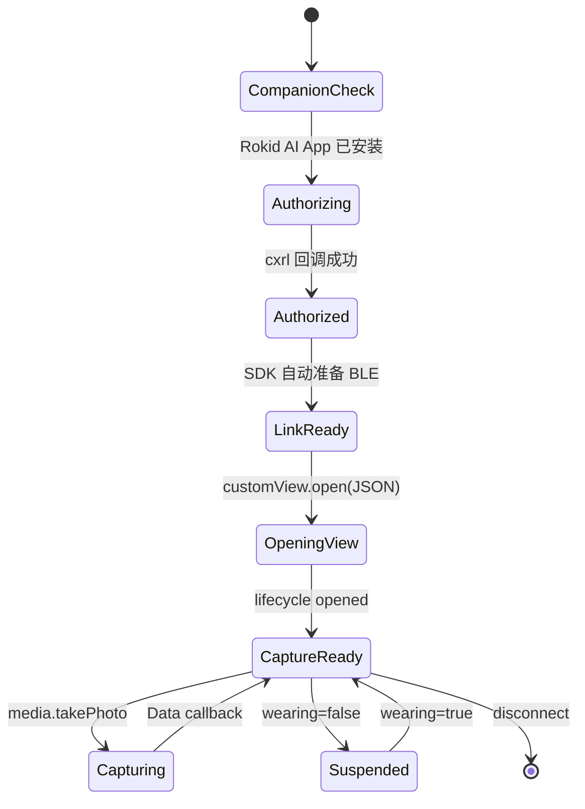
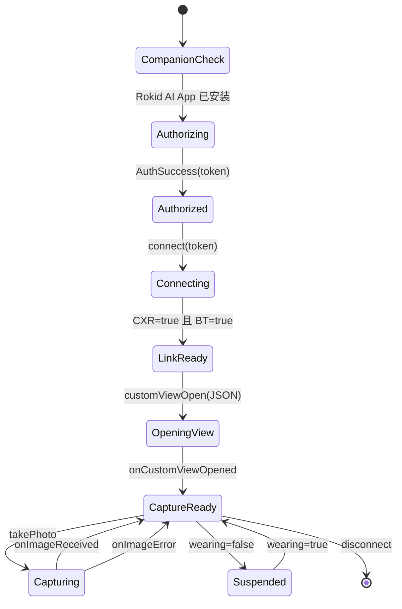

# CXR-L Token 与状态流

## 结论

CXR-L 第一阶段不应从 Rokid 账户中心复制一个授权 key 写进 App。iOS 和 Android 都通过 Rokid AI App 获取运行时授权。

## iOS 主方案

iOS 使用 URL Scheme：

```text
Probe App
  -> rokidai:// 发起授权
  -> Rokid AI App
  -> cxrl://auth/callback 返回 Probe
  -> SDK 自动准备 BLE 通道
```

推荐使用新接口：

```swift
let link = CxrClient.makeLink(appDisplayName: "Reality CXR-L Probe")
let session = link.makeCustomViewSession()

link.authenticate(scopes: [.camera, .microphone]) { result in
    // 成功后 SDK 自动准备 BLE，不需要手动 connect(token)。
}

func scene(_ scene: UIScene, openURLContexts contexts: Set<UIOpenURLContext>) {
    guard let url = contexts.first?.url else { return }
    _ = link.handleOpenURL(url)
}
```

`Info.plist` 必须声明：

- 回调 Scheme：`cxrl`
- 可查询 Scheme：`rokidai`
- 后台模式：`bluetooth-central`
- 蓝牙权限说明：`NSBluetoothAlwaysUsageDescription`

## Android 备用方案

官方 Android Sample 的实际流程是：

```kotlin
AuthorizationHelper.requestAuthorization(
    activity,
    arrayOf(
        GlassPermission.CAMERA,
        GlassPermission.MICROPHONE,
        GlassPermission.MEDIA
    ),
    REQUEST_CODE_AUTH
)
```

授权完成后：

```kotlin
when (val result =
    AuthorizationHelper.parseAuthorizationResult(resultCode, data)
) {
    is AuthResult.AuthSuccess -> cxrLink.connect(result.token)
    is AuthResult.AuthFail -> ...
    is AuthResult.AuthCancel -> ...
}
```

因此有两类容易混淆的凭据：

| 凭据 | 位置 | Phase 0 是否写入代码 |
|---|---|---|
| 开发者账户的授权 key | Rokid 账户中心 | 否 |
| CXR-L 运行时 token | Rokid AI App 授权回调 | 是，但只保存在当前进程内存 |

## iOS 完整状态机



## Android 完整状态机



## 安全约束

- 不在源码、Gradle、Manifest、日志中写 token。
- 不把 OpenAI API key 放入 Android App。
- iOS 也不打印完整 token，URL 回调交给 SDK 解析。
- token 在 App 被杀后丢失，下次重新授权或使用 SDK 的历史授权结果。
- 图片默认只在内存中展示；落盘和上传必须是后续明确开启的策略。
- 日志不得打印 token，只允许记录 `token present` 或长度。
