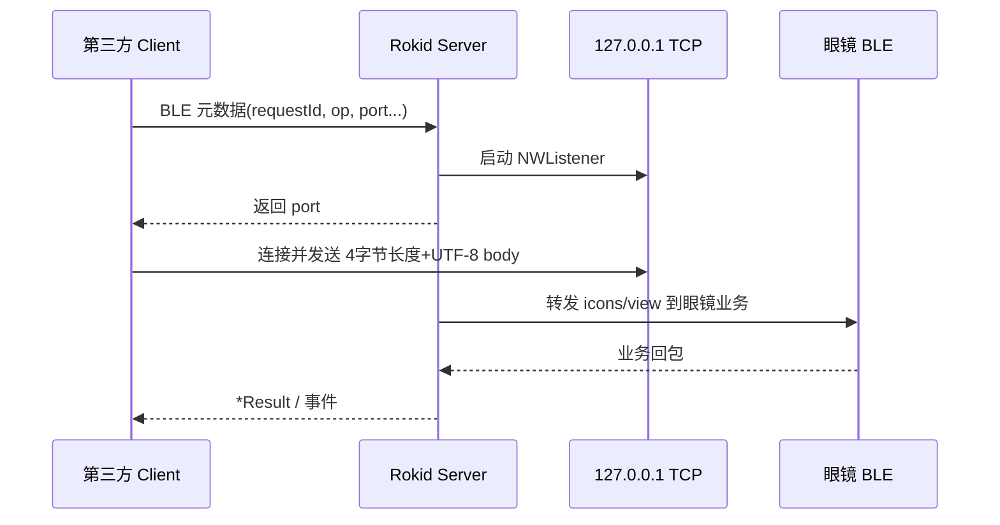

# RGCxr CXR-L 1.0.3 更新说明

---

## 一、概述

本次更新主要面向 **第三方 App（`customApp` 模式）** 与 **自定义 View（`customView` 模式）**：

1. **设备信息 / 佩戴 / AI 唤醒拦截**：Client 新增查询与事件流，Server 通过回调向 Rokid App 取数，并经 BLE 与眼镜同步。
2. **大 payload 传输**：`sendCustomCmdStream` 与 customView 的 icons/view 文本改走 **127.0.0.1 本地 TCP**，BLE 只传元数据与端口；超时由约 1 秒调整为 **30 秒**（customView 大文本）或 **5 秒**（`closeCustomView` 仍走 BLE）。

---

## 二、拦截语音唤醒 & 佩戴状态监听

### 2.1 RGCxrClient 新增 Public 接口（重点）

#### 2.1.1 新增事件流（Combine `AnyPublisher`）

| 属性 | 类型 | 说明 |
|------|------|------|
| `deviceInfoEventPublisher` | `AnyPublisher<RGCxrDeviceInfo, Never>` | 设备信息变化（主动查询结果也会推送一次） |
| `wearingStatusEventPublisher` | `AnyPublisher<Bool, Never>` | 佩戴状态，`true` = 已佩戴 |
| `aiWakeInterruptEventPublisher` | `AnyPublisher<Bool, Never>` | AI 唤醒拦截状态，`true` = 眼镜**不响应**语音唤醒 AI 助手 |

订阅前需完成 CXR 鉴权与会话；`deviceInfo` / `wearing` 数据由 Server 经 BLE 转发或回调组装。

#### 2.1.2 新增方法

```swift
// 自定义指令 + 大二进制：小参数 BLE，stream 走本地 TCP
@discardableResult
func sendCustomCmdStream(
    cmd: String,
    payload: Data?,
    stream: Data,
    callback: ((_ success: Bool, _ payload: Data?, _ errorCode: Int32?, _ errorMsg: String?) -> Void)?
) -> RGCxrClientError?

// 拉取当前眼镜设备信息
@discardableResult
func getDeviceInfo(callback: ((RGCxrDeviceInfo?) -> Void)?) -> RGCxrClientError?

// 查询佩戴检测开关是否开启
@discardableResult
func getWearingSwitch(callback: ((Bool) -> Void)?) -> RGCxrClientError?

// 设置是否拦截 AI 语音唤醒；true = 拦截
@discardableResult
func interruptAiWake(_ interruptWake: Bool, callback: ((Bool) -> Void)?) -> RGCxrClientError?
```

**调用约束（与实现一致）：**

| API | 模式 | 其他前置条件 |
|-----|------|----------------|
| `sendCustomCmdStream` | `customApp` | `openApp` 已成功 |
| `getDeviceInfo` / `getWearingSwitch` / `interruptAiWake` | `customApp` | 已建立 CXR 会话 |
| 三个 `*EventPublisher` | 同上 | 被动推送，无需单独调用 |

失败时返回 `RGCxrClientError?`（如 `notAuthorized`、`notReady` 等），与现有 API 一致。

---

## 三、customView 大文本走本地 TCP

### 3.1 RGCxrClient Public 接口变化

**无新增方法签名**，下列接口的**行为与注释**更新（实现变更）：

| 方法 | 变更要点 |
|------|----------|
| `sendCustomViewIcons(_:callback:)` | 大 JSON 经本地 TCP；约 **30 秒**内未完成（含 TCP + 眼镜回包）→ `callback(false)` |
| `openCustomView(_:callback:)` | View 描述走 TCP；失败或超时 `success=false`，`errorCode=nil`（`-1` 仍表示 OTA/Phone 占用） |
| `updateCustomView(_:callback:)` | 同 open，30 秒超时 |
| `closeCustomView(_:callback:)` | **仍仅 BLE**，约 **5 秒**超时（注释已区分） |

`API.md` 中对应表格已同步上述超时与传输方式说明。

### 3.2 传输流程（简述）



- **Client**：`RGCxrClientCustomViewPayloadUploadService`（`sendIcons` / `open` / `update`）
- **Server**：`RGCxrCustomViewPayloadUploadService`（单例，按 `operation` 区分）
- 协议与 `custom_cmd_upload` 一致：**UInt32 little-endian 长度 + UTF-8 文本**，最大约 32MB，含心跳保活。

---

## 四、集成建议

### 4.1 第三方 App（customApp）

```swift
// 订阅
client.deviceInfoEventPublisher.sink { info in /* 更新 UI */ }
client.wearingStatusEventPublisher.sink { wearing in /* ... */ }
client.aiWakeInterruptEventPublisher.sink { interrupted in /* ... */ }

// 查询 / 控制
client.getDeviceInfo { info in }
client.getWearingSwitch { switchOn in }
client.interruptAiWake(true) { success in }

// 大二进制自定义命令
client.sendCustomCmdStream(cmd: "myCmd", payload: smallData, stream: largeData) { ... }
```

进入页面前确保：`openApp` 成功，且已通过 `auth` 鉴权。

### 4.2 自定义 View（customView）

- 继续使用 `sendCustomViewIcons` / `openCustomView` / `updateCustomView`，但需接受 **更长等待（~30s）** 与 TCP 失败场景。
- UI 层建议增加加载态，避免仍按 1 秒超时处理。

---
