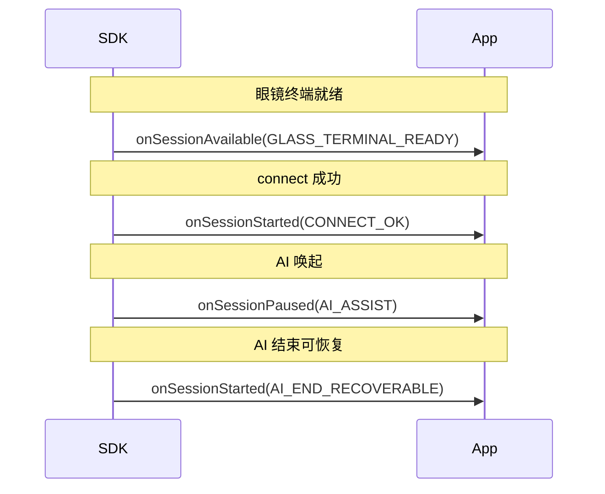
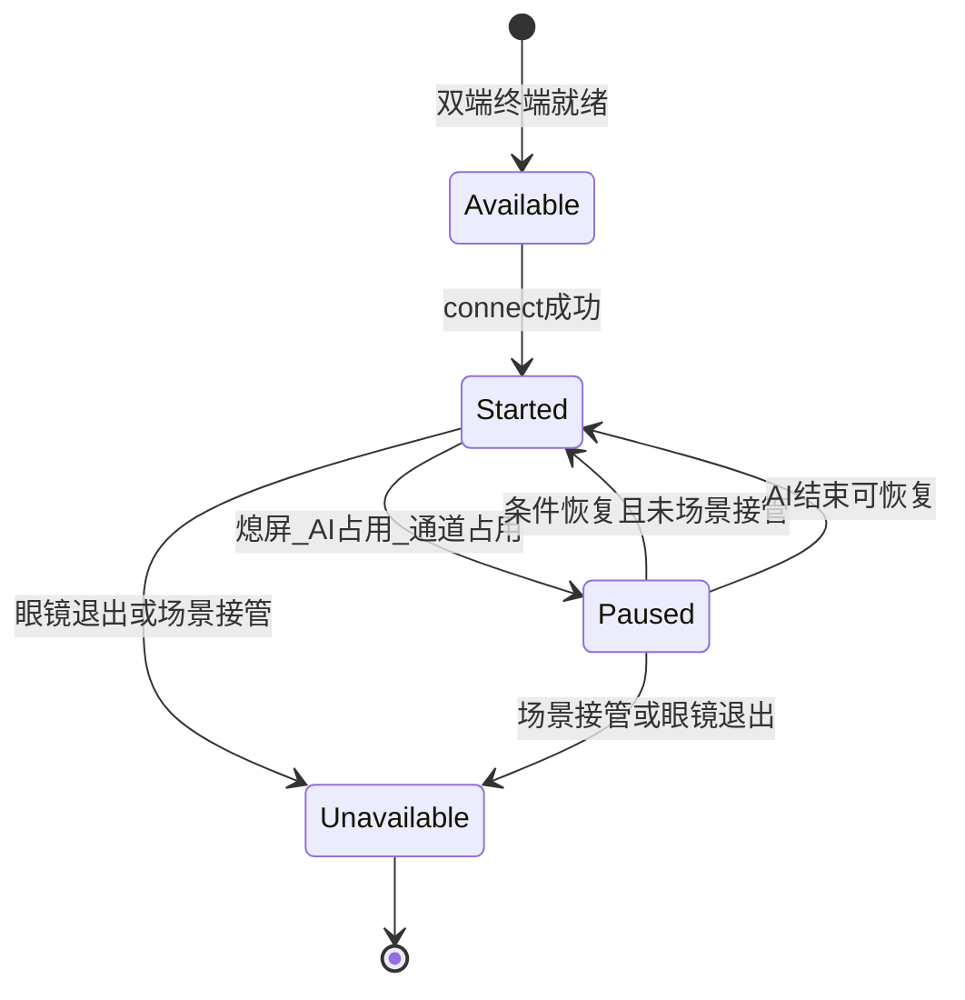

# CXR-L SDK 1.0.4 产品需求文档（PRD）

| 属性 | 内容 |
|------|------|
| 文档版本 | v1.2 |
| 产品版本 | CXR-L SDK **1.0.4** |
| 基线版本 | 1.0.3（Sample 当前依赖 `com.rokid.cxr:client-l:1.0.3`） |
| 状态 | 草案（待评审） |
| 关联需求编号 | SDKL260428102-0017、0021、0025 |
| 延后需求 | SDKL260428102-002、003、004（≥1.0.5，见 §2.4、§11.4） |

---

## 1. 背景与目标

### 1.1 背景

CXR-L SDK 面向在 Rokid 眼镜生态中开发**手机伴侣应用**的第三方开发者。眼镜与手机之间的拍照、录音、自定义视图/应用、自定义指令等能力，均需在**受控会话**内完成。

1.0.3 及 Sample 工程已验证：Token 授权、`connect`、CustomView / CustomApp 会话、拍照/音频**流式**回调、AI 打断等基础链路。1.0.4 聚焦：

- **四态会话**（可用 / 开始 / 暂停 / 不可用）显式化，**各态独立生命周期回调**；
- 创建会话时的 **AI 拦截策略**；
- **亮度与音量**设备控制；
- **归一化错误码**及可交付的错误码说明文档。

1.0.3 已有流式拍照、录音能力在 1.0.4 **继续可用**，本版不扩展眼镜端多媒体文件落盘与同步（002/003/004 延后）。

### 1.2 业务问题

| 问题 | 影响 |
|------|------|
| 会话生命周期语义分散在连接回调与业务代码中，缺少标准四态与监听 | 熄屏、AI 占用、场景切换时易出现竞态与资源泄漏 |
| 亮度/音量无法通过 SDK 调节 | 体验依赖 Rokid AI APP 设置，应用无法闭环控制 |
| 错误以 `Int code + String` 分散在各回调，无统一枚举与文档 | 排障成本高，无法做监控归因 |

### 1.3 目标（SMART）

| 目标 | 指标 | 时间窗口 |
|------|------|----------|
| 会话四态可观测、可恢复 | 四态独立回调 + AI 两条路径（可恢复 / 场景接管）用例 100% 可测 | 1.0.4 发布 |
| 设备控制接口可用 | 亮度/音量设置与查询在会话 `Started` 时可用 | 1.0.4 发布 |
| 错误码可文档化 | 发布《CXR-L 错误码说明》v1.0（见附录 B），覆盖 1.0.4 公开 API 失败路径 ≥ 90% | 与 SDK 同步发布 |

### 1.4 成功指标

- **北极星**：接入方在 1 个工作日内完成「创建会话 → connect → 实现 `ISessionLifecycleCbk` → 在 `Started` 下调用流式能力 / 设备控制」闭环（参考 Sample 改造）。
- **过程指标**：会话异常恢复率（Paused → Started）、错误码文档查询命中率。
- **保护指标**：不因新能力导致 1.0.3 已有 `connect` / 流回调行为破坏性变更（semver：minor 增强）。

---

## 2. 用户与场景

### 2.1 目标用户

| 角色 | 诉求 |
|------|------|
| 第三方 App 开发者 | 稳定 API、四态状态机、可查询错误码 |
| 集成/测试工程师 | 可复现状态迁移、可自动化验收 |
| 终端用户（间接） | 流式拍照/录音可靠，AI 与业务场景不互相「卡死」 |

### 2.2 核心场景

1. **语音笔记**：CustomView 会话 `Started` 下开始音频流；AI 唤醒 → **Paused**；AI 结束且未打开其他 CXR 场景 → **Started**；流式采集由 App 决定是否重启（SDK 不自动 restart）。
2. **提词器抢占**：用户通过 AI 打开提词器 → 会话 **Unavailable**（眼镜端会话终端退出/被接管）；AI 结束后**不**自动回到 `Started`。
3. **设备适配**：`Started` 下由 App 调用 SDK 设置眼镜亮度/音量。
4. **会话销毁**：App 调用 `destroySession()` → 收到 `onSessionDestroyed()`；该操作**不**将四态置为 `Unavailable`（`Unavailable` 仅表示眼镜端会话终止，见 §4.2.2）。

### 2.3 异常场景

| 场景 | 期望行为 |
|------|----------|
| 蓝牙断开 | 视策略进入 **Paused**（`onSessionPaused(LINK_LOST)`）或返回 `LINK_NOT_AVAILABLE` |
| 手机熄屏 | **Paused**；亮屏且条件恢复 → **Started** |
| 未授权相机/麦克风 | 流式回调 `onImageError` / `onAudioError` 返回归一化码；引导 `GlassPermission` |
| 业务在 Paused 调用拍照 | 同步 API 返回 `SESSION_PAUSED`；已在进行的流由 SDK 安全停止（与 Sample AI 打断行为对齐） |

### 2.4 不覆盖范围（Out of Scope）

**1.0.4 不做：**

- SDKL260428102-002 / 003 / 004：眼镜端多媒体文件落盘、存储管理、同步至手机；
- `mediaId`、`syncMediaToPhone`、Wi-Fi 直传、批量文件同步、断点续传；
- 多会话并发（默认单活跃会话）。

**通用不覆盖：**

- 云存储、CDN、转码（接入方自建）；
- 眼镜端系统相册 / 文件管理 UI 改造；
- 非 CXR-L 链路（如纯蓝牙 A2DP）。

---

## 3. 需求定义

### 3.1 需求总览

| 编号 | 需求名称 | 优先级 | 版本 |
|------|----------|--------|------|
| SDKL260428102-0017 | Session 生命周期管理（四态） | Must | 1.0.4 |
| SDKL260428102-0021 | 归一化错误码 | Must | 1.0.4 |
| SDKL260428102-0025 | 亮度与音量控制 | Should | 1.0.4 |
| SDKL260428102-002 | 多媒体录制（眼镜端落盘） | Deferred | ≥1.0.5 |
| SDKL260428102-003 | 眼镜端多媒体文件存储与管理 | Deferred | ≥1.0.5 |
| SDKL260428102-004 | 多媒体文件同步至手机 | Deferred | ≥1.0.5 |

### 3.2 用户故事

| ID | 用户故事 |
|----|----------|
| US-03 | 作为开发者，我希望通过独立回调（`onSessionAvailable` / `onSessionStarted` / `onSessionPaused` / `onSessionUnavailable`）监听四态进入事件，以便只实现关心的生命周期逻辑。 |
| US-04 | 作为开发者，我希望在创建会话时配置是否拦截系统 AI，以便在「允许 AI（暂停可恢复）」与「独占会话」之间取舍。 |
| US-05 | 作为开发者，我希望通过 SDK 设置眼镜亮度与音量，以便应用内一站式调节体验。 |
| US-06 | 作为开发者，我希望所有失败路径返回统一错误码并可查文档，以便日志、监控与客服归因。 |

---

## 4. 功能详细说明

### 4.2 Session 生命周期管理（0017）

#### 4.2.1 概念定义

**会话（Session）**：一次眼镜端与手机端之间的 CXR-L 业务通信上下文。流式拍照、录音、CustomView / CustomApp、自定义指令等，均应在**同一会话**内完成。

**终端**：

- **手机端会话终端**：由 SDK 在手机进程内创建与管理（`createSession` / `destroySession`）。
- **眼镜端会话终端**：由眼镜系统与 Rokid AI APP 在手机端 CXR-L SDK 授权通过后创建；与手机终端成对存在时，方可进入**可用**及之后业务态。

**四态 vs 会话操作**：四态仅描述**业务通信就绪程度**；`createSession`、`destroySession` 为会话管理操作，**不是**四态之一。`Unavailable` **仅**表示眼镜端会话终端退出或被系统场景接管；手机端 `destroySession` 成功通过 `onSessionDestroyed()` 通知。

#### 4.2.2 状态定义

| 状态 | 英文标识 | 含义 | 典型触发 |
|------|----------|------|----------|
| 可用 | `Available` | 双端会话终端均存在且就绪，尚未满足全部通信条件 | 眼镜端终端就绪 |
| 开始 | `Started` | 条件完备，可正常通信 | `connect(token)` 成功且链路可用 |
| 暂停 | `Paused` | 通道被占用或必要条件不满足，终端仍保留 | 熄屏、AI 占用（不拦截模式）、链路抖动 |
| 不可用 | `Unavailable` | **仅**眼镜端会话终端退出或被系统场景接管 | 眼镜主动退出、提词器等 CXR 场景抢占 |

#### 4.2.3 SDK 操作与状态查询

**A. 会话管理操作（非四态）**

| 操作 | 说明 | 与 1.0.3 映射 |
|------|------|----------------|
| `createSession(config)` | 创建手机端终端；含类型、包名、AI 策略 | `CXRLink` + `configCXRSession` |
| `connect(token)` | 建立通信；`startSession` 可作为别名 | `connect(token)` |
| `disconnect()` | 断开链路；状态回 **Available**（眼镜端终端仍在） | 部分场景等价断开 |
| `destroySession()` | 销毁手机端终端；回调 `onSessionDestroyed` | `resetSession` + 释放 `CXRLink` |

**B. 状态查询与注册**

- `getSessionState(): Available | Started | Paused | Unavailable`（同步查询当前态）
- `setSessionLifecycleCbk(ISessionLifecycleCbk)`：注册四态独立回调（**主路径**）
- （可选辅助）`sessionStateFlow: StateFlow<SessionState>`：与 `getSessionState` 一致，供 Compose/协程订阅；**不替代**独立回调

**评审待确认**：`disconnect()` 后若眼镜端终端仍存在，统一回 `Available`（本 PRD 默认采用）。

#### 4.2.4 生命周期回调

通过 `ISessionLifecycleCbk` 注册；各方法提供**默认空实现**（Kotlin `default` / Java 8+ 接口默认方法），接入方仅 override 关心的回调。

```kotlin
interface ISessionLifecycleCbk {
    /** 进入「可用」：双端终端就绪；或 disconnect 后回到可用 */
    fun onSessionAvailable(reason: SessionStateReason? = null) {}

    /** 进入「开始」：可正常通信 */
    fun onSessionStarted(reason: SessionStateReason? = null) {}

    /** 进入「暂停」 */
    fun onSessionPaused(reason: SessionStateReason? = null) {}

    /** 进入「不可用」：仅眼镜端退出或场景接管 */
    fun onSessionUnavailable(reason: SessionStateReason? = null) {}

    /** 手机端 destroySession 成功；非四态 */
    fun onSessionDestroyed() {}
}
```

**连接结果（与四态分离，挂在 `CXRLink` 或同类入口）**

| 回调 | 触发时机 |
|------|----------|
| `onConnectResult(success, errorCode?)` | `connect` 结束；`success=false` 时不调用 `onSessionStarted` |

| 回调 | 触发时机 | `reason` 示例 |
|------|----------|----------------|
| `onSessionAvailable` | 进入 `Available` | `GLASS_TERMINAL_READY`；`disconnect` 后回可用 |
| `onSessionStarted` | 进入 `Started` | `CONNECT_OK`；`AI_END_RECOVERABLE` |
| `onSessionPaused` | 进入 `Paused` | `SCREEN_OFF`；`AI_ASSIST`；`LINK_LOST` |
| `onSessionUnavailable` | 进入 `Unavailable` | `GLASS_EXIT`；`AI_SCENE_TAKEOVER` |
| `onSessionDestroyed` | `destroySession()` 成功 | — |

**`SessionStateReason`（`reason` 参数，可空）**

| 枚举 | 含义 | 典型触发回调 |
|------|------|--------------|
| `GLASS_TERMINAL_READY` | 眼镜端终端就绪 | `onSessionAvailable` |
| `CONNECT_OK` | 连接成功 | `onSessionStarted` |
| `SCREEN_OFF` | 手机熄屏 | `onSessionPaused` |
| `AI_ASSIST` | AI 占用 | `onSessionPaused` |
| `LINK_LOST` | 链路丢失 | `onSessionPaused` |
| `AI_END_RECOVERABLE` | AI 结束可恢复 | `onSessionStarted` |
| `GLASS_EXIT` | 眼镜端退出 | `onSessionUnavailable` |
| `AI_SCENE_TAKEOVER` | 场景接管（如提词器） | `onSessionUnavailable` |
| `OTHER` | 未分类 | 任意；日志诊断 |

**回调契约**

| 规则 | 说明 |
|------|------|
| 仅进入态触发 | `Started → Paused` 只调 `onSessionPaused`，不调 `onSessionStarted` |
| 去重 | 同一态连续进入由 SDK 去重，不重复回调 |
| 顺序 | 与 §4.2.5 状态机一致；一次迁移最多触发**一个**四态进入回调 |
| destroy | 仅 `onSessionDestroyed()`；**不**因销毁调用 `onSessionUnavailable` |
| connect 失败 | 不调用 `onSessionStarted`；走 `onConnectResult(false, errorCode)` |



#### 4.2.5 状态机



#### 4.2.6 AI 事件拦截策略

```kotlin
data class SessionConfig(
    val sessionType: CXRSessionType,
    val packageName: String? = null,
    val aiInterceptMode: AiInterceptMode = AiInterceptMode.ALLOW_WITH_PAUSE
)

enum class AiInterceptMode {
    ALLOW_WITH_PAUSE,
    BLOCK_AI
}
```

| 模式 | AI 唤起 | AI 结束且未打开其他 CXR 场景 | AI 打开提词器等 |
|------|---------|------------------------------|-----------------|
| `ALLOW_WITH_PAUSE` | → **Paused** | → **Started** | → **Unavailable**，不自动恢复 |
| `BLOCK_AI` | 系统/SDK 拦截（能力受限见 Release Note） | — | — |

**与 Sample 1.0.3 对齐**：

- `ICXRLinkCbk.onGlassAiInterrupt` → `onSessionPaused(AI_ASSIST)`；
- `onGlassAiAssistStart/Stop` 标记 deprecated，由 `onSessionPaused` / `onSessionStarted` / `onSessionUnavailable` 承接。

**流式能力在 Paused（推荐，与 Sample 一致）**：

| 场景 | 行为 |
|------|------|
| Paused 时新发起 `takePhoto` / `startAudioStream` | 同步拒绝，`SESSION_PAUSED` |
| Paused 时已在进行的音频流 | SDK 安全 `stopAudioStream`；不自动 restart |
| Paused 时进行中的拍照 | 取消并 `onImageError`（如 `OPERATION_CANCELLED`） |

#### 4.2.7 与能力模块依赖

| 能力 | 最低会话状态 |
|------|--------------|
| 1.0.3 流式拍照（`IImageStreamCbk`） | **Started** |
| 1.0.3 流式录音（`IAudioStreamCbk`） | **Started** |
| CustomView / CustomApp | **Started** |
| 亮度/音量**设置** | **Started** |
| 亮度/音量**查询** | **Started**；**Paused** 允许只读 |
| 非 Started 调用业务 API | **Available** → `SESSION_NOT_AVAILABLE`；**Unavailable** → `SESSION_UNAVAILABLE` |

---

### 4.3 亮度与音量（0025）

#### 4.3.1 功能范围

| 能力 | 说明 |
|------|------|
| 设置亮度 | `setBrightness(level)`，iOS 当前为固件档位 0–15 |
| 查询亮度 | `getBrightness()` |
| 设置音量 | `setVolume(level)`，iOS 当前为固件档位 0–15 |
| 查询音量 | `getVolume()` |

#### 4.3.2 前置与约束

- **设置**：会话 `Started`；`Paused` 返回 `SESSION_PAUSED`。
- **查询**：`Started` 或 `Paused`（只读）。
- 蓝牙/链路不可用：`LINK_NOT_AVAILABLE`。
- 固件不支持：`BRIGHTNESS_NOT_SUPPORTED` / `VOLUME_NOT_SUPPORTED`。

---

### 4.4 归一化错误码（0021）

#### 4.4.1 目标

将 SDK 错误与已捕获异常映射为稳定整型码；对外 `(errorCode, message?)`；禁止向接入方抛堆栈。

#### 4.4.2 编码规范

| 段位 | 含义 |
|------|------|
| `0` | 成功 |
| `1xxx` | 会话与连接 |
| `2xxx` | 授权与权限 |
| `3xxx` | 流式多媒体（1.0.3 兼容，非 002/003/004 文件 API） |
| `4xxx` | 设备控制 |
| `5xxx` | 参数与调用 |
| `6xxx` | 会话管理操作（非四态） |
| `9xxx` | 内部/未知 |
| `31xx` | **预留**：002/003/004 文件与同步（≥1.0.5，见附录 B.3） |

#### 4.4.3 交付物

1. SDK：`com.rokid.cxr.link.error.CxrErrorCode`（或等价）常量/枚举。
2. 文档：附录 B《CXR-L 错误码说明 v1.0》——开发据此建表与实现映射。
3. 兼容：附录 B.4《1.0.3 回调 code 对照（过渡）》。

#### 4.4.4 摘要清单

完整字段见**附录 B**。1.0.4 最小集：

| 码 | 名称 |
|----|------|
| 0 | OK |
| 1001–1010 | 会话/连接（含四态相关） |
| 2001–2004 | 授权/权限 |
| 3001–3010 | 流式拍照/录音/CustomView |
| 4001–4006 | 亮度/音量 |
| 5001–5005 | 参数/状态/超时 |
| 6001–6003 | create/connect/destroy 操作 |
| 9999 | UNKNOWN |

---

## 5. 方案对比与决策

### 5.1 会话：隐式 connect vs 显式四态

| 方案 | 结论 |
|------|------|
| 在 1.0.3 `connect` 外包装四态与 `ISessionLifecycleCbk` 独立回调 | **采纳**；`connect` 保留，`startSession` 为别名 |

### 5.2 AI：默认拦截 vs 默认不拦截

| 方案 | 结论 |
|------|------|
| 默认 `ALLOW_WITH_PAUSE` | **采纳**；独占场景选 `BLOCK_AI` |

### 5.3 多媒体 002/003/004

| 方案 | 结论 |
|------|------|
| 1.0.4 仅保留 1.0.3 流式能力 | **采纳**；文件落盘与同步 ≥1.0.5 |

---

## 6. 非功能需求

| 类别 | 要求 |
|------|------|
| 安全 | Token 不落日志明文；流式数据落盘路径在应用沙箱 |
| 兼容 | Android minSdk 与 1.0.3 一致；废弃 API `@Deprecated` + 替代说明 |
| 可测试性 | 内部提供会话状态 Mock/钩子（不对外承诺） |

---

## 7. 验收标准（Given-When-Then）

### 7.1 会话（0017）

**AC-S01 四态迁移**

- **Given** 新会话，双端终端就绪，已注册 `ISessionLifecycleCbk`  
- **When** `createSession` → 眼镜就绪 → `connect` 成功 → 模拟熄屏 → 恢复 → `disconnect`  
- **Then** 依次触发 `onSessionAvailable` → `onSessionStarted` → `onSessionPaused` → `onSessionStarted` → `onSessionAvailable`；`getSessionState()` 与最后一次进入回调一致  

**AC-S02 AI 可恢复**

- **Given** `ALLOW_WITH_PAUSE`，`Started`，音频流进行中  
- **When** 唤起 AI 后结束，未打开其他 CXR 场景  
- **Then** `onSessionStarted` → `onSessionPaused(AI_ASSIST)` → `onSessionStarted(AI_END_RECOVERABLE)`；音频不自动 restart  

**AC-S03 提词器 → Unavailable**

- **Given** 同上  
- **When** AI 打开提词器  
- **Then** 触发 `onSessionUnavailable(AI_SCENE_TAKEOVER)`；AI 结束后**无** `onSessionStarted`  

**AC-S04 Paused 拒绝新业务**

- **Given** `Paused`  
- **When** 调用 `takePhoto` 或 `startAudioStream`  
- **Then** 返回 `SESSION_PAUSED`（或回调等价错误码）  

**AC-S05 销毁非 Unavailable**

- **Given** `Started`  
- **When** `destroySession()` 成功  
- **Then** 收到 `onSessionDestroyed`；销毁过程**未**触发 `onSessionUnavailable`（销毁前若已为 `Unavailable` 则除外）  

### 7.2 亮度音量（0025）

**AC-D01**：`Started` 下 `setBrightness(8)` → `getBrightness()` 在容差内。  
**AC-D02**：`Paused` 下 `setBrightness` → `SESSION_PAUSED`；`getBrightness` 仍可调用。

### 7.3 错误码（0021）

**AC-E01**：附录 B 表内每条码在 SDK 实现中有常量定义，且至少一条失败路径可触发。  
**AC-E02**：公开 API 失败路径 ≥ 90% 能映射到附录 B 中非 `UNKNOWN` 码。  
**AC-E03**：`onImageError` / `onAudioError` / `onCustomViewError` 的 `code` 均 ∈ `CxrErrorCode`。

---

## 8. 依赖与风险

| 依赖 | 说明 |
|------|------|
| 眼镜固件 | 亮度/音量档位、AI 场景事件 |
| Sprite / 授权 SDK | Token、`GlassPermission` |
| 系统 AI / 场景调度 | 提词器接管 → `Unavailable` 依赖系统上报 |

| 风险 | 等级 | 缓解 |
|------|------|------|
| 四态与 1.0.3 隐式连接语义不一致 | 高 | 迁移指南；Sample 展示四态 |
| `BLOCK_AI` 受系统限制 | 中 | Release Note 声明 |
| AI 场景识别不全 | 中 | `OTHER` + 日志 |

---

## 9. 里程碑与协作

| 里程碑 | 交付 |
|--------|------|
| M1 方案评审 | 本 PRD v1.2 + 附录 B |
| M2 Alpha | 四态状态机 + `CxrErrorCode` 骨架 |
| M3 Beta | 亮度音量 + Sample 四态展示 + 流式错误码对齐 |
| M4 RC | 错误码说明定稿 + 1.0.3 迁移指南 |
| M5 发布 | 1.0.4 Maven + Release Note |

**Sample 验收**：升级 `client-l:1.0.4`；Hub 展示四态；亮度/音量调试入口；**不**要求媒体库/同步页。

---

## 10. 上线与文档

| 项 | 内容 |
|----|------|
|              |                                                             |
| 回滚 | Maven 保留 1.0.3 |
| 文档 | 《连接与会话》《设备控制》《错误码说明》（附录 B 同步发布） |
| Release Note | 四态、AI 策略、错误码、002/003/004 延后说明 |

---

## 11. 附录

### 11.1 术语表

| 术语 | 定义 |
|------|------|
| 四态 | Available / Started / Paused / Unavailable |
| 会话终端 | 会话在单侧设备上的运行时实例 |
| Unavailable | 仅眼镜端会话终止或场景接管，非手机 destroy |

### 11.2 与 Sample 代码对应（1.0.3）

| PRD | Sample（1.0.3） | 1.0.4 目标 |
|-----|----------------|------------|
| 连接/会话 | `CxrSessionGate`、`CXRLApplication.sharedLink` | 同上 + `setSessionLifecycleCbk` |
| 拍照流 | `PhotoUsageViewModel`、`IImageStreamCbk` | 不变 |
| 音频流 | `AudioUsageViewModel`、`IAudioStreamCbk` | 不变 |
| AI 打断 | `onGlassAiInterrupt` | → `onSessionPaused(AI_ASSIST)` |
| 连接就绪 | `onCXRLConnected(true)` | → `onSessionStarted(CONNECT_OK)` |
| 断开连接 | `onCXRLConnected(false)` | → `onSessionAvailable` 或 `onSessionPaused`，与策略一致 |
| 本地 UI 阶段 | `CxrScenePhase` | 由 SDK 四态 + 独立回调替代 |

### 11.3 修订记录

| 版本 | 日期 | 说明 |
|------|------|------|
| v1.0 | 2026-06-03 | 初版（含多媒体与六态） |
| v1.1 | 2026-06-03 | 002/003/004 延后；四态会话；附录 B 错误码初版 |
| v1.2 | 2026-06-03 | 四态改为独立生命周期回调（`ISessionLifecycleCbk`），移除 `onSessionStateChanged` |

### 11.4 延后需求 backlog（002/003/004）

| 编号 | 能力 | 目标版本 |
|------|------|----------|
| 002 | 眼镜端拍照/录像/录音落盘 | ≥1.0.5 |
| 003 | 眼镜端文件列举/配额 | ≥1.0.5 |
| 004 | 同步至手机 | ≥1.0.5 |

预留错误码段：`31xx`（见附录 B.3）。

---

## 附录 B：CXR-L 错误码说明 v1.0（初版）

> **用途**：SDK 研发据此创建 `CxrErrorCode` 与内部映射；接入方据此处理失败与监控归因。  
> **范围**：1.0.4（四态会话、设备控制、1.0.3 流式能力）。不含 002/003/004 文件 API。

### B.1 设计约定

| 项 | 约定 |
|----|------|
| 类型 | `int` 常量，稳定后不修改数值 |
| 成功 | `0`（`CXR_OK`） |
| Message | 英文简短描述；可选中文；禁止包含堆栈 |
| 回调签名 | `fun onXxxError(errorCode: Int, message: String?)` |
| 会话态变化 | **不**通过错误码传递；使用 `ISessionLifecycleCbk` 四态进入回调 |
| 可重试 | `Y` 建议重试；`N` 需修复前置；`C` 视上下文 |

### B.2 错误码总表（1.0.4）

#### B.2.1 成功（0）

| 码 | 常量名 | 中文说明 | 触发条件 | 处理建议 | 可重试 |
|----|--------|----------|----------|----------|--------|
| 0 | `CXR_OK` | 成功 | 操作成功 | — | — |

#### B.2.2 会话与连接（1xxx）

| 码 | 常量名 | 中文说明 | 触发条件 | 处理建议 | 可重试 |
|----|--------|----------|----------|----------|--------|
| 1001 | `SESSION_NOT_AVAILABLE` | 会话未进入可通信态 | 当前为 `Available`，未 `connect` | 先 `connect(token)` | N |
| 1002 | `SESSION_NOT_STARTED` | 会话未开始 | 状态非 `Started` 且非允许只读的查询 | 等待 `Started` | C |
| 1003 | `SESSION_PAUSED` | 会话已暂停 | 当前 `Paused`，拒绝写操作 | 等待恢复或提示用户 | C |
| 1004 | `SESSION_UNAVAILABLE` | 眼镜端会话不可用 | 当前 `Unavailable` | 重新建立会话/引导用户回应用 | N |
| 1005 | `LINK_NOT_AVAILABLE` | 链路不可用 | BT/CXR-L 链路断开 | 检查连接与佩戴 | Y |
| 1006 | `CONNECT_FAILED` | 连接失败 | `connect` 失败 | 检查 token、网络、眼镜状态 | Y |
| 1007 | `CONNECT_TIMEOUT` | 连接超时 | `connect` 超时 | 重试 connect | Y |
| 1008 | `SESSION_ALREADY_EXISTS` | 会话已存在 | 重复 `createSession` | 先 `destroySession` 或复用实例 | N |
| 1009 | `SESSION_NOT_CREATED` | 会话未创建 | 未 create 即 connect/业务调用 | 先 `createSession` | N |
| 1010 | `OPERATION_CANCELLED` | 操作已取消 | Paused/AI 打断取消进行中的拍照等 | 提示用户稍后重试 | C |

#### B.2.3 授权与权限（2xxx）

| 码 | 常量名 | 中文说明 | 触发条件 | 处理建议 | 可重试 |
|----|--------|----------|----------|----------|--------|
| 2001 | `TOKEN_INVALID` | Token 无效 | token 为空、过期、校验失败 | 重新授权获取 token | N |
| 2002 | `TOKEN_EXPIRED` | Token 已过期 | 授权过期 | 刷新 token | Y |
| 2003 | `PERMISSION_DENIED` | 权限未授予 | 无 CAMERA/MIC 等 `GlassPermission` | 跳转授权 | N |
| 2004 | `AUTHORIZATION_FAILED` | 授权失败 | 授权 SDK 返回失败 | 检查 AppId/签名/网络 | Y |

#### B.2.4 流式多媒体（3xxx，1.0.3 兼容）

| 码 | 常量名 | 中文说明 | 触发条件 | 处理建议 | 可重试 |
|----|--------|----------|----------|----------|--------|
| 3001 | `AUDIO_STREAM_START_FAILED` | 音频流启动失败 | `startAudioStream` 失败 | 检查会话态与 MIC 权限 | Y |
| 3002 | `AUDIO_STREAM_STOP_FAILED` | 音频流停止失败 | `stopAudioStream` 失败 | 记录日志；释放本地资源 | C |
| 3003 | `AUDIO_STREAM_ERROR` | 音频流错误 | `onAudioError` 通用 | 根据 message 排查 | C |
| 3004 | `AUDIO_DEVICE_BUSY` | 音频设备占用 | 眼镜端音频被占用 | 稍后重试 | Y |
| 3005 | `IMAGE_CAPTURE_FAILED` | 拍照失败 | `takePhoto` / `onImageError` | 检查 CAMERA、会话态 | Y |
| 3006 | `IMAGE_DECODE_FAILED` | 图像解码失败 | 流数据损坏 | 重拍 | Y |
| 3007 | `IMAGE_STREAM_ERROR` | 图像流错误 | `onImageError` 未分类 | 记录 code 升级 SDK | C |
| 3008 | `CUSTOM_VIEW_ERROR` | 自定义视图错误 | `onCustomViewError` | 检查 JSON/会话 | C |
| 3009 | `CUSTOM_VIEW_NOT_OPEN` | 自定义视图未打开 | 在未 open 时 update/close | 先 `customViewOpen` | N |
| 3010 | `GLASS_APP_ERROR` | 眼镜应用错误 | `IGlassAppCbk` 失败路径 | 检查包名/APK | C |

#### B.2.5 设备控制（4xxx）

| 码 | 常量名 | 中文说明 | 触发条件 | 处理建议 | 可重试 |
|----|--------|----------|----------|----------|--------|
| 4001 | `BRIGHTNESS_NOT_SUPPORTED` | 不支持亮度调节 | 固件无能力 | 隐藏 UI | N |
| 4002 | `VOLUME_NOT_SUPPORTED` | 不支持音量调节 | 固件无能力 | 隐藏 UI | N |
| 4003 | `BRIGHTNESS_OUT_OF_RANGE` | 亮度参数越界 | level 非法 | iOS 校验 0–15 | N |
| 4004 | `VOLUME_OUT_OF_RANGE` | 音量参数越界 | level/stream 非法 | 校验参数 | N |
| 4005 | `BRIGHTNESS_SET_FAILED` | 设置亮度失败 | 系统调用失败 | 重试 | Y |
| 4006 | `VOLUME_SET_FAILED` | 设置音量失败 | 系统调用失败 | 重试 | Y |

#### B.2.6 参数与调用（5xxx）

| 码 | 常量名 | 中文说明 | 触发条件 | 处理建议 | 可重试 |
|----|--------|----------|----------|----------|--------|
| 5001 | `INVALID_ARGUMENT` | 参数非法 | null、空串、非法枚举 | 修正入参 | N |
| 5002 | `INVALID_SESSION_TYPE` | 会话类型非法 | CustomApp 无包名等 | 修正 SessionConfig | N |
| 5003 | `SDK_NOT_INITIALIZED` | SDK 未初始化 | 未 create Context/Link | 先初始化 | N |
| 5004 | `OPERATION_NOT_SUPPORTED` | 操作不支持 | 当前固件/模式不支持 | 降级功能 | N |
| 5005 | `OPERATION_TIMEOUT` | 操作超时 | 同步调用超时 | 重试 | Y |

#### B.2.7 会话管理操作（6xxx，非四态）

| 码 | 常量名 | 中文说明 | 触发条件 | 处理建议 | 可重试 |
|----|--------|----------|----------|----------|--------|
| 6001 | `SESSION_CREATE_FAILED` | 创建会话失败 | `createSession` 失败 | 检查 config/资源 | Y |
| 6002 | `SESSION_DESTROY_FAILED` | 销毁会话失败 | `destroySession` 失败 | 强制释放本地引用 | C |
| 6003 | `SESSION_CONFIG_INVALID` | 会话配置无效 | config 字段组合非法 | 修正 config | N |

#### B.2.8 内部与未知（9xxx）

| 码 | 常量名 | 中文说明 | 触发条件 | 处理建议 | 可重试 |
|----|--------|----------|----------|----------|--------|
| 9999 | `UNKNOWN` | 未知错误 | 未映射异常 | 带 code/message 上报；升级 SDK | C |

### B.3 预留：多媒体文件（31xx，≥1.0.5）

> 1.0.4 **不得**在公开 API 返回下列码；可在 `CxrErrorCode` 中 `@Deprecated` 占位或注释预留。

| 码 | 常量名 | 说明 |
|----|--------|------|
| 3101 | `MEDIA_NOT_FOUND` | mediaId 不存在 |
| 3102 | `MEDIA_SYNC_FAILED` | 同步失败 |
| 3103 | `MEDIA_STORAGE_FULL` | 存储已满 |
| 3104 | `RECORDING_IN_PROGRESS` | 重复开始录制 |
| 3105 | `RECORDING_NOT_ACTIVE` | 未录制却 stop |
| 3106 | `MEDIA_LIST_FAILED` | 列举失败 |

### B.4 1.0.3 回调 code 过渡对照（示例）

> 1.0.4 起回调应优先返回 B.2 归一码。下表供迁移期对照，**以 SDK Release Note 为准**。

| 1.0.3 场景 | 建议映射至 |
|------------|------------|
| `onAudioError` 未知正数 | `AUDIO_STREAM_ERROR`(3003) 或细分 3001–3004 |
| `onImageError` 未知正数 | `IMAGE_STREAM_ERROR`(3007) 或 `IMAGE_CAPTURE_FAILED`(3005) |
| `onCustomViewError` | `CUSTOM_VIEW_ERROR`(3008) |
| connect 失败（无码） | `CONNECT_FAILED`(1006) |

### B.5 SDK 实现检查清单

- [ ] `CxrErrorCode` 与 B.2 数值一致，禁止重复码段
- [ ] 所有 `throw` 与 native 错误经 `ErrorMapper` 映射，不泄露裸异常码
- [ ] `SESSION_*` 与 `getSessionState()` 四态一致
- [ ] 单元测试：每个 `1xxx`/`4xxx` 至少 1 条触发用例
- [ ] 生成脚本：由 B.2 CSV/Markdown 生成常量类（可选）

---

**假设与待确认项（1.0.4）**

1. `disconnect()` 后统一回 `Available`（本 PRD 默认）。  
2. `BLOCK_AI` 系统能力边界在 Release Note 声明。  
3. 1.0.3 历史 `onAudioError`/`onImageError` 裸码与 B.4 对照表由研发在 Beta 前补全。
