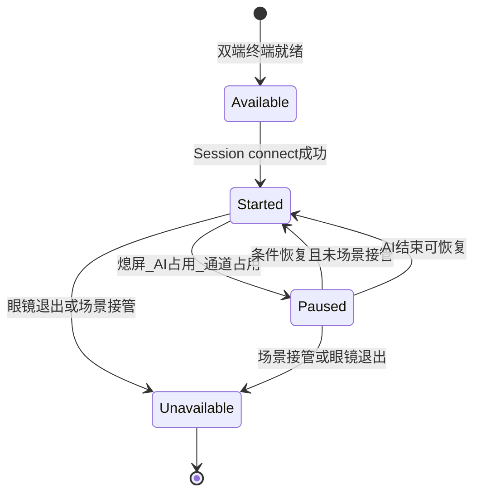

### 1.4 成功指标
+ **北极星**：接入方在 1 个工作日内完成「创建会话 → connect → 实现 `ISessionLifecycleCbk` → 在 `Started` 下调用流式能力 / 设备控制」闭环（参考 Sample 改造）。
+ **过程指标**：会话异常恢复率（Paused → Started）、错误码文档查询命中率。
+ **保护指标**：不因新能力导致 1.0.3 已有 `connect` / 流回调行为破坏性变更（semver：minor 增强）。

### 2.2 核心场景
1. **语音笔记**：CustomView 会话 `Started` 下开始音频流；AI 唤醒 → **Paused**；AI 结束且未打开其他 CXR 场景 → **Started**；流式采集由 App 决定是否重启（SDK 不自动 restart）。
2. **提词器抢占**：用户通过 AI 打开提词器 → 会话 **Unavailable**（眼镜端会话终端退出/被接管）；AI 结束后**不**自动回到 `Started`。
3. **设备适配**：`Started` 下由 App 调用 SDK 设置眼镜亮度/音量。
4. **会话销毁**：App 调用 `destroySession()` → 收到 `onSessionDestroyed()`；该操作**不**将四态置为 `Unavailable`（`Unavailable` 仅表示眼镜端会话终止，见 §4.2.2）。

### 3.2 用户故事
| ID | 用户故事 |
| --- | --- |
| US-03 | 作为开发者，我希望通过独立回调（`onSessionAvailable` / `onSessionStarted` / `onSessionPaused` / `onSessionUnavailable`）监听四态进入事件，以便只实现关心的生命周期逻辑。 |
| US-04 | 作为开发者，我希望在创建会话时配置是否拦截系统 AI，以便在「允许 AI（暂停可恢复）」与「独占会话」之间取舍。 |


### 4.2 Session 生命周期管理（0017）
#### 4.2.1 概念定义
**会话（Session）**：一次眼镜端与手机端之间的 CXR-L 业务通信上下文。流式拍照、录音、CustomView / CustomApp、自定义指令等，均应在**同一会话**内完成。

**终端**：

+ **手机端会话终端**：由 SDK 在手机进程内创建与管理（`createSession` / `destroySession`）。
+ **眼镜端会话终端**：由眼镜系统与 Rokid AI APP 在手机端 CXR-L SDK 授权通过后创建；与手机终端成对存在时，方可进入**可用**及之后业务态。

**四态 vs 会话操作**：四态仅描述**业务通信就绪程度**；`createSession`、`destroySession` 为会话管理操作，**不是**四态之一。`Unavailable` **仅**表示眼镜端会话终端退出或被系统场景接管；手机端 `destroySession` 成功通过 `onSessionDestroyed()` 通知。

#### 4.2.2 状态定义
| 状态 | 英文标识 | 含义 | 典型触发 |
| --- | --- | --- | --- |
| 可用 | `Available` | 双端会话终端均存在且就绪，尚未满足全部通信条件 | 眼镜端终端就绪 |
| 开始 | `Started` | 条件完备，可正常通信 | `connect(token)` 成功且链路可用 |
| 暂停 | `Paused` | 通道被占用或必要条件不满足，终端仍保留 | 熄屏、AI 占用（不拦截模式）、链路抖动 |
| 不可用 | `Unavailable` | **仅**眼镜端会话终端退出或被系统场景接管 | 眼镜主动退出、提词器等 CXR 场景抢占 |


#### 4.2.3 SDK 操作与状态查询
**A. 会话管理操作（非四态）**

| 操作 | 说明 | 与 1.0.3 映射 |
| --- | --- | --- |
| cxrl.`createSession(config)` | 创建手机端终端；含类型、包名、AI 策略 |  `configCXRSession` |
| `cxrl.connect(token)` | 建立通信；`startSession` 可作为别名 | `connect(token)` |
| `disconnect()` | 断开链路；状态回 Un**Available**（通知眼镜端会话结束）, | 部分场景等价断开- |
|  |  |  |


**B. 状态查询与注册**

+ `getSessionState(): Available | Started | Paused | Unavailable`（同步查询当前态）
+ `setSessionLifecycleCbk(ISessionLifecycleCbk)`：注册四态独立回调（**主路径**）
+ （可选辅助）`sessionStateFlow: StateFlow<SessionState>`：与 `getSessionState` 一致，供 Compose/协程订阅；**不替代**独立回调

**评审待确认**：`disconnect()` 后若眼镜端终端仍存在，统一回 `Available`（本 PRD 默认采用）。

#### 4.2.4 生命周期回调
通过 `ISessionLifecycleCbk` 注册；各方法提供**默认空实现**（Kotlin `default` / Java 8+ 接口默认方法），接入方仅 override 关心的回调。

```kotlin
interface ISessionLifecycleCbk {
    /** 进入「可用」：双端终端就绪；或 disconnect 后回到可用 */
    fun onSessionAvailable(reason: SessionStateReason? = null) {}

    /** 进入「开始」：可正常通信 */
    fun onSessionStarted(reason: SessionStateReason? = null) {}

    /** 进入「暂停」 */
    fun onSessionPaused(reason: SessionStateReason? = null) {}

    /** 进入「不可用」：仅眼镜端退出或场景接管 */
    fun onSessionUnavailable(reason: SessionStateReason? = null) {}

}
```

**连接结果（与四态分离，挂在 **`CXRLink`** 或同类入口）**

| 回调 | 触发时机 |
| --- | --- |
| `onConnectResult(success, errorCode?)` | `connect` 结束；`success=false` 时不调用 `onSessionStarted` |


| 回调 | 触发时机 | `reason` 示例 |
| --- | --- | --- |
| `onSessionAvailable` | 进入 `Available` | `SESSION_LINK_CONNECTED``~~SESSION_AI_STOP~~` |
| `onSessionStarted` | 进入 `Started` | `SESSION_GLASS_READY` |
| `onSessionPaused` | 进入 `Paused` | `SESSION_AI_START` |
| `onSessionUnavailable` | 进入 `Unavailable` | `SESSION_GLASS_IDEL``SESSION_LINK_DISCONNECTED` |
|  |  |  |


`SessionStateReason`**（**`reason`** 参数，可空）**

| 枚举 | 含义 | 典型触发回调 |
| --- | --- | --- |
| `SESSION_GLASS_READY` | 眼镜端终端就绪(CUSTOMVIEW_OPEN、CUSTOM_APP_OPEN) | `onSessionStarted` |
| `SESSION_LINK_CONNECTED` | Rokid AI APP Link成功 | `onSessionAvailable` |
| `SESSION_SCREEN_OFF_GLASS` | Glasses 熄屏 | `onSessionPaused` |
| `SESSION_AI_START` | AI 助手占用 | `onSessionPaused` |
| `SESSION_LINK_DISCONNECTED` | Rokid AI APP AIDL 链路丢失 | `onSessionUnavailable` |
| `SESSION_AI_STOP` | AI 助手结束 | `~~onSessionAvailable~~` |
| `SESSION_GLASS_IDEL` | 眼镜端终端退出(CUSTOMVIEW_CLOSE、CUSTOM_APP_CLOSE) | `onSessionUnavailable` |
| `SESSION_SCENES_TAKEOVER` | 其他场景接管（如提词器/翻译/慧眼/支付等） | `onSessionUnavailable` |
| `SESSION_OTHER` | 未分类 | 任意；日志诊断 |


**回调契约**

| 规则 | 说明 |
| --- | --- |
| 仅进入态触发 | `Started → Paused` 只调 `onSessionPaused`，不调 `onSessionStarted` |
| 去重 | 同一态连续进入由 SDK 去重，不重复回调 |
| 顺序 | 与 §4.2.5 状态机一致；一次迁移最多触发**一个**四态进入回调 |
| destroy | 仅 `onSessionDestroyed()`；**不**因销毁调用 `onSessionUnavailable` |
| connect 失败 | 不调用 `onSessionStarted`；走 `onConnectResult(false, errorCode)` |




#### 4.2.6 AI 事件拦截策略
```kotlin
data class SessionConfig(
    val sessionType: CXRSessionType,
    val packageName: String? = null,
    val aiInterceptMode: AiInterceptMode = AiInterceptMode.ALLOW_WITH_PAUSE
)

enum class AiInterceptMode {
    ALLOW_WITH_PAUSE,
    BLOCK_AI
}
```

| 模式 | AI 唤起 | AI 结束且未打开其他 CXR 场景 | AI 打开提词器等 |
| --- | --- | --- | --- |
| `ALLOW_WITH_PAUSE` | → **Paused** | → **Started** | → **Unavailable**，不自动恢复 |
| `BLOCK_AI` | 系统/SDK 拦截（能力受限见 Release Note） | — | — |


**与 Sample 1.0.3 对齐**：

+ `ICXRLinkCbk.onGlassAiInterrupt` → `onSessionPaused(AI_ASSIST)`；
+ `onGlassAiAssistStart/Stop` 标记 deprecated，由 `onSessionPaused` / `onSessionStarted` / `onSessionUnavailable` 承接。

**流式能力在 Paused（推荐，与 Sample 一致）**：

| 场景 | 行为 |
| --- | --- |
| Paused 时新发起 `takePhoto` / `startAudioStream` | 同步拒绝，`SESSION_PAUSED` |
| Paused 时已在进行的音频流 | SDK 安全 `stopAudioStream`；不自动 restart |
| Paused 时进行中的拍照 | 取消并 `onImageError`（如 `OPERATION_CANCELLED`） |


### 7.1 会话（0017）
**AC-S01 四态迁移**

+ **Given** 新会话，双端终端就绪，已注册 `ISessionLifecycleCbk`  
+ **When** `createSession` → 眼镜就绪 → `connect` 成功 → 模拟熄屏 → 恢复 → `disconnect`  
+ **Then** 依次触发 `onSessionAvailable` → `onSessionStarted` → `onSessionPaused` → `onSessionStarted` → `onSessionAvailable`；`getSessionState()` 与最后一次进入回调一致

**AC-S02 AI 可恢复**

+ **Given** `ALLOW_WITH_PAUSE`，`Started`，音频流进行中  
+ **When** 唤起 AI 后结束，未打开其他 CXR 场景  
+ **Then** `onSessionStarted` → `onSessionPaused(AI_ASSIST)` → `onSessionStarted(AI_END_RECOVERABLE)`；音频不自动 restart

**AC-S03 提词器 → Unavailable**

+ **Given** 同上  
+ **When** AI 打开提词器  
+ **Then** 触发 `onSessionUnavailable(AI_SCENE_TAKEOVER)`；AI 结束后**无** `onSessionStarted`

**AC-S04 Paused 拒绝新业务**

+ **Given** `Paused`  
+ **When** 调用 `takePhoto` 或 `startAudioStream`  
+ **Then** 返回 `SESSION_PAUSED`（或回调等价错误码）

**AC-S05 销毁非 Unavailable**

+ **Given** `Started`  
+ **When** `destroySession()` 成功  
+ **Then** 收到 `onSessionDestroyed`；销毁过程**未**触发 `onSessionUnavailable`（销毁前若已为 `Unavailable` 则除外）

### 11.1 术语表
| 术语 | 定义 |
| --- | --- |
| 四态 | Available / Started / Paused / Unavailable |
| 会话终端 | 会话在单侧设备上的运行时实例 |
| Unavailable | 仅眼镜端会话终止或场景接管，非手机 destroy |


